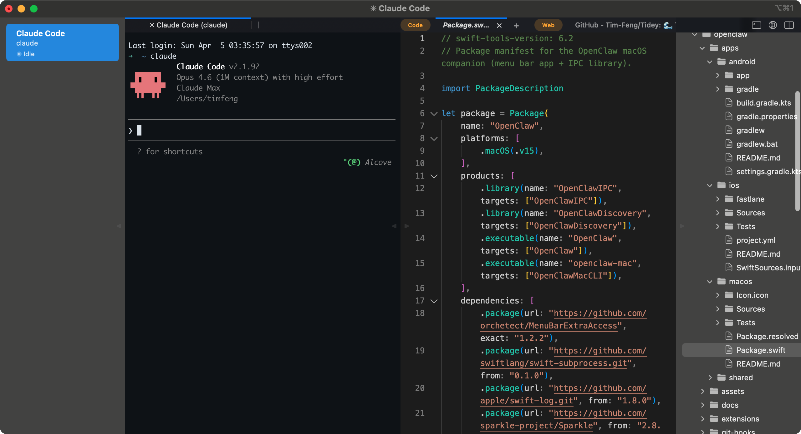
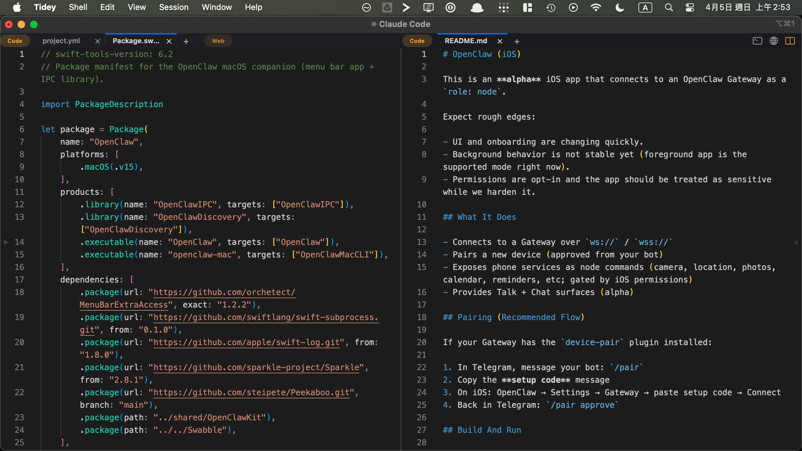
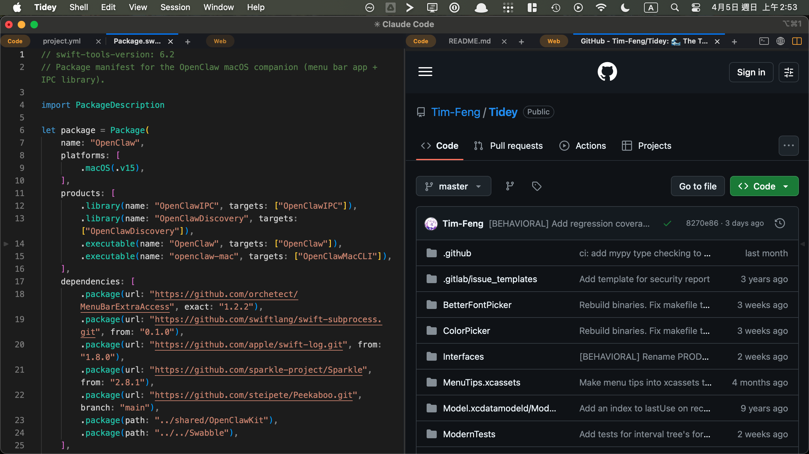

# 🌊 Tidey

> Where context flows between agent and code, like the tide.

A terminal-first IDE for AI agents. Run agents in workspaces, edit code side by side, see what each agent is doing — all in one window.



## Install

**Download:** [Tidey-1.0.0.dmg](https://github.com/Tim-Feng/Tidey/releases/latest) (macOS 12+, Apple Silicon & Intel)

1. Open the DMG, drag Tidey to Applications
2. First launch: right-click → Open
3. Tidey may ask to install shell integration — click "Install"

<details>
<summary>Build from source</summary>

```bash
git clone https://github.com/Tim-Feng/Tidey.git
cd Tidey
make setup
make Development
```

Requires Xcode, [rustup](https://rustup.rs), and Homebrew.

</details>

## How It Works

**Workspaces** — each workspace is an agent session with its own terminal, status, and notifications. ⌘1–⌘9 to switch.

**Editor** — ⌘-click any file path in the terminal to open it. Syntax highlighting, search, save. Auto-refreshes when files change externally. Works offline.

**Code / Web Tabs** — the right panel manages code tabs and web tabs together, so files and pages stay in the same working context.

**Split View** — split the right panel into two panes, mix code and web tabs on either side, and drag tabs across panes.

**In-app Browser** — ⌘-click URLs in the terminal opens them in the right-side browser panel instead of leaving the IDE.

**Claude Code** — just type `claude`. Tidey automatically tracks status (Running / Idle / Needs input), shows notifications when Claude finishes or needs your attention, and sets the workspace title. Works in tmux too.

**Layout** — sidebar, terminal, editor, and file tree are all independently collapsible and resizable. File tree auto-updates on changes. Built on iTerm2's terminal emulation.

| Split View | Code + Browser |
|---|---|
|  |  |

## Keyboard Shortcuts

| Action | Shortcut |
|--------|----------|
| New Workspace | ⌘N |
| New Panel | ⌘T |
| Close | ⌘W |
| Switch Workspace | ⌘1–⌘9 (⌘9 = last) |
| Next / Previous Workspace | ⌃⌘] / ⌃⌘[ |
| Last Workspace | ⌃⌘\ |
| Show/Hide Sidebar | ⌘B |
| Show/Hide Editor | ⇧⌘E |
| Show/Hide Terminal | ⇧⌘T |
| Show/Hide File Tree | ⌃⌘F |
| Toggle Split View | click split icon |
| Find in Editor | ⌘F |
| Switch Panel / Editor Tab | ⌃1–⌃9 |
| Save | ⌘S |
| Reset Layout | double-click any divider |

Hold ⌘ for a moment to see shortcut hints on toggle buttons and panel tabs.

Top-right icons:
- terminal — new terminal panel
- web — new browser tab
- split — toggle split view

## Documentation

- [AGENTS.md](AGENTS.md) — agent guide for Codex (OpenAI Codex CLI)
- [CLAUDE.md](CLAUDE.md) — development rules for Claude Code
- Tidey is developed with a dual-agent workflow: Claude Code handles audit / build / test / coordination, and Codex handles implementation
- [Socket API](docs/socket-api.md) — for agent developers integrating with Tidey
- [Debug Lessons](docs/debug-lessons.md) — pitfalls and solutions discovered during development

## Credits

Tidey is inspired by [cmux](https://cmux.com), built on [iTerm2](https://iterm2.com), and integrates the [Monaco](https://microsoft.github.io/monaco-editor/) editor — combining all three into a terminal-first agent IDE.

## License

GPLv2+ — see [LICENSE](LICENSE) and [COPYING](COPYING) for details.
